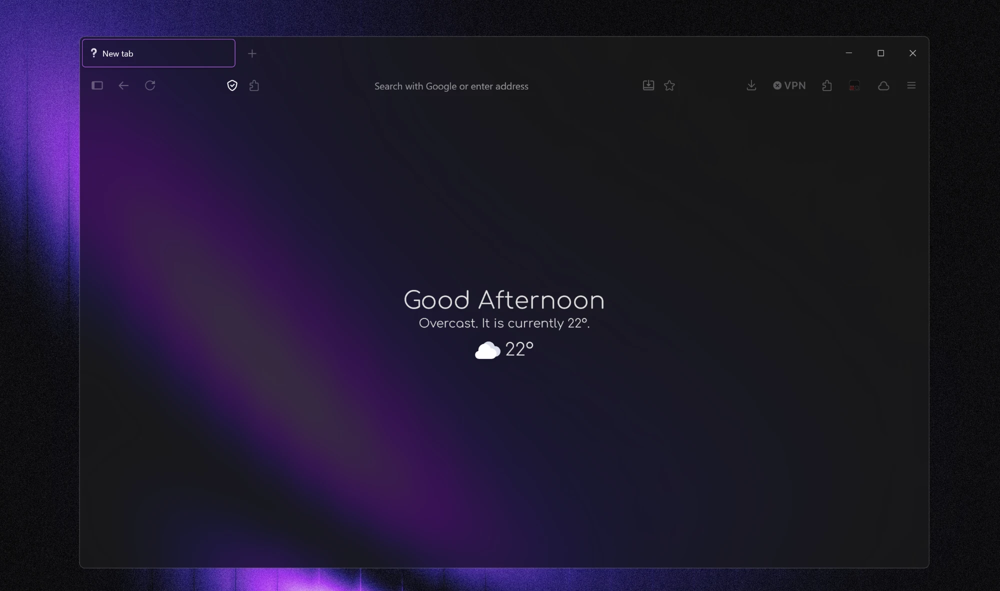
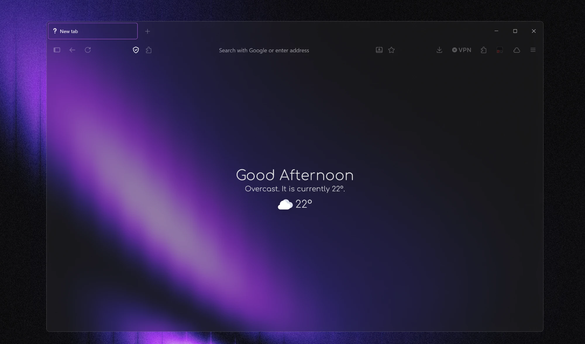

# Latin Accent Plus

A transparent Firefox theme that uses your system accent color. Just two CSS files: no extensions, no scripts.

A fork of [Latin Accent](https://github.com/Acercandr0/Latin-Accent) by Acercandr0, updated for current Firefox.


## Changes to base Latin Accent

- **Vertical tabs:** the selected tab border works again in Firefox's vertical tabs.
- **Bookmarks bar** follows Firefox's setting. With *Only Show on New Tab*, it's hidden on every tab and appears when you hover the top of the window.
- **Tab switching** springs the page in instead of cutting (from [Zen-Nebula](https://github.com/JustAdumbPrsn/Zen-Nebula)).
- **Audio tabs** get an animated equalizer instead of a static speaker icon.
- **Inactive tab titles** are dimmed less, so they stay readable.
- **Picture-in-Picture** gets frosted-glass controls (from Zen-Nebula).
- **Fullscreen warning** is a compact pill.
- **Websites** always get a solid background, so transparent sites stay readable, and selected text uses your accent color.
- **Fixes for current Firefox:** window buttons, the downloads highlight, and bookmark folder menus, which used to be dimmed.
- **One-line installer** for Windows.

---

## 🛠 Installation

### ⚡ Quick way (Windows)

Paste this into PowerShell and press Enter:

```powershell
irm https://raw.githubusercontent.com/rs4t/latin-accent-plus/main/install.ps1 | iex
```

It finds your Firefox profile, backs up any theme files you already have, downloads the theme, and enables the settings it needs. It only touches your Firefox profile folder. You can read what it does in [install.ps1](install.ps1).

<details>
<summary><b>Manual install</b> (or Mac/Linux)</summary>

**1. Copy the files.** Open `about:profiles`, find the **Root Directory** of your active profile and open it. Create a `chrome` folder there if it doesn't exist, and copy [`userChrome.css`](chrome/userChrome.css) and [`userContent.css`](chrome/userContent.css) into it.

**2. Enable custom CSS.** In `about:config`, set this to **true**:

```
toolkit.legacyUserProfileCustomizations.stylesheets
```

**3. Necessary flags.** In `about:config`, set these to **true**:

```
browser.tabs.allow_transparent_browser
widget.windows.mica
gfx.webrender.all
```

</details>

Then pick a transparency option:

### 🪟 Transparency – Option 1: Firefox's built-in Mica

In `about:config`, set this to **2**:

```
widget.windows.mica.toplevel-backdrop
```



### 🪟 Transparency – Option 2: Windhawk

Use [**Translucent Windows (Windhawk mod)**](https://windhawk.net/mods/translucent-windows).



### 🧪 Optional but recommended – Bonjourr new tab page

The theme makes the new tab page transparent, and [**Bonjourr**](https://addons.mozilla.org/firefox/addon/bonjourr-startpage/) is a great way to fill it.

1. Install [**Bonjourr**](https://addons.mozilla.org/firefox/addon/bonjourr-startpage/).
2. Open Bonjourr's settings and turn on **Show all settings** at the top. Then customize everything to your liking.
3. Find the **Custom style** section and paste this CSS. It makes the background transparent and uses the Comfortaa font (loaded from Google Fonts):

<details>
<summary>Show the CSS</summary>

```css
@import url("https://fonts.googleapis.com/css2?family=Comfortaa:wght@300&display=swap");

body,
h1,
h2,
h3,
h4,
h5,
h6,
p,
span,
div {
  font-family: "Comfortaa", sans-serif !important;
  font-weight: 300 !important;
  letter-spacing: 0.015em;
  font-smooth: always;
  -webkit-font-smoothing: antialiased;
  -moz-osx-font-smoothing: grayscale;
  transition:
    color 0.3s ease,
    text-shadow 0.3s ease;
}

/* Light mode */
@media (prefers-color-scheme: light) {
  body,
  h1,
  h2,
  h3,
  h4,
  h5,
  h6,
  p,
  span,
  div {
    color: #222222;
    text-shadow: 0 0 1px rgba(0, 0, 0, 0.15);
  }
}

/* Dark mode */
@media (prefers-color-scheme: dark) {
  body,
  h1,
  h2,
  h3,
  h4,
  h5,
  h6,
  p,
  span,
  div {
    color: #e0e0e0;
    text-shadow: 0 0 1px rgba(255, 255, 255, 0.2);
  }
}

h1 {
  font-weight: 400 !important;
  letter-spacing: 0.025em;
}

p {
  font-weight: 300 !important;
  line-height: 1.6;
  letter-spacing: 0.015em;
}
#background {
  background-color: transparent !important;
}
#background {
  background-image: none !important;
  background-color: transparent !important;
}
.tabbing {
  background-color: transparent !important;
}
body {
  background-color: transparent !important;
}
#background-wrapper {
  opacity: 0 !important;
}
```

</details>

4. Let the theme load Bonjourr without a black flash. It needs Bonjourr's ID:
   - **Quick way users:** install Bonjourr first, restart Firefox once, then run the quick-way command again. It fills the ID in for you.
   - **Manual users:** open `about:debugging#/runtime/this-firefox`, copy Bonjourr's **Internal UUID**, and replace `YOUR-BONJOURR-UUID` in `userContent.css` with it. Repeat this if you ever reinstall Bonjourr.

### 💬 Notes

- Fully close Firefox and reopen it after installing, not just a reload.
- Transparency depends on Windows 11 and your graphics setup, so it can look a bit different per machine. The transparency options are Windows-only.

---

## Customize

At the top of `userChrome.css`:

| Variable | What it does |
| --- | --- |
| `--accent-color` | Replace `AccentColor` with any color, like `#a855f7`, to stop following your system accent |
| `--inactive-opacity` | How dim toolbar buttons are before you hover them |
| `--inactive-tab-opacity` | How dim inactive tab titles are |
| `--border-radius` | How round tabs and buttons are |

Every section is labeled, so you can delete any feature you don't like. If a website shows a weird solid box, delete the `background-color: Canvas` block at the top of `userContent.css`. If something breaks after a Firefox update, please [open an issue](../../issues).

## Credits

[Latin Accent](https://github.com/Acercandr0/Latin-Accent) by Acercandr0, the theme this is built on. [Zen-Nebula](https://github.com/JustAdumbPrsn/Zen-Nebula) by JustADumbPrsn, where the tab switch animation and Picture-in-Picture look come from.
